# Configurer et gérer vos sources IA dédiée au contenu

Ce guide vous guide tout au long de la configuration des sources d’IA dédiée au contenu dans Cloud Manager, depuis le respect des conditions préalables à la création d’une source de contenu et la confirmation qu’elle est indexée et disponible.

## Conditions préalables {#prerequisites}

Avant de commencer, assurez-vous que les conditions suivantes sont remplies :

* Vous disposez d’un programme Cloud Manager actif avec au moins un environnement AEM as a Cloud Service.
* Votre utilisateur est affecté au profil de produit **Utilisateurs** pour l’environnement cible, ce qui lui permet d’afficher les sources de contenu.
* Votre utilisateur est affecté au profil de produit **Administrateurs** pour l’environnement cible, ce qui lui permet de créer et de modifier des sources de contenu. L’accès à Cloud Manager seul n’est pas suffisant. Voir [Affecter un utilisateur à un profil de produit AEM](#assign-product-profile) ci-dessous.
* Le profil de produit de l’environnement a été configuré dans ****.

## Affectation d’un utilisateur à un profil de produit AEM {#assign-product-profile}

Utilisez cette procédure pour accorder à un utilisateur l’accès à [!DNL Adobe Experience Manager] as a Cloud Service pour un environnement spécifique. Attribuez le profil correspondant à l’accès dont l’utilisateur a besoin :

* **[!UICONTROL Utilisateurs AEM]** - afficher les sources de contenu.
* **[!UICONTROL Administrateurs AEM]** - créer et modifier des sources de contenu.

>[!NOTE]
>
>Les utilisateurs doivent appartenir à un profil de produit AEM tel que **[!UICONTROL Utilisateurs AEM]** ou **[!UICONTROL Administrateurs AEM]** pour accéder à AEM. L’accès à Cloud Manager seul n’est pas suffisant.

Pour affecter ces profils, vous devez être un administrateur système avec le profil de produit Cloud Manager [!UICONTROL Propriétaire de l’entreprise]. Préparez le nom et l’adresse électronique de l’utilisateur.

1. Dans , accédez à votre programme et sélectionnez **[!UICONTROL Gérer l’accès]** pour l’environnement cible. Un nouvel onglet s’ouvre [!DNL Adobe Admin Console] pour cet environnement.
1. Sélectionnez le profil de produit **[!UICONTROL Utilisateurs]** ou **[!UICONTROL Administrateurs AEM]** pour le niveau **publication**, par exemple, `AEM Administrators - publish - Program 12345 - Environment 67890`. L’IA dédiée au contenu indexe le contenu publié. Par conséquent, le profil doit être attribué au niveau de la publication, et non de l’auteur.
1. Sélectionnez **[!UICONTROL Ajouter un utilisateur]**.
1. Saisissez le nom et l’adresse e-mail de l’utilisateur, puis enregistrez la modification. L’utilisateur est ajouté au profil de produit.

Répétez ces étapes pour chaque environnement auquel l’utilisateur doit accéder, comme le développement, l’évaluation ou la production.

>[!CAUTION]
>
>Ne modifiez ou ne supprimez pas les profils de produit par défaut nommés **[!UICONTROL Administrateurs]** ou **[!UICONTROL Utilisateurs AEM]**. Le changement de nom de **[!UICONTROL Administrateurs]** supprime les droits d’administrateur de toutes les personnes qui lui sont affectées.

### Vérifier l’affectation {#verify-assignment}

Pour vérifier que l’affectation a réussi :

1. Dans [!DNL Admin Console], rouvrez le profil de produit que vous avez affecté.
1. Vérifiez que l’utilisateur apparaît dans la liste des membres.

Si vous résolvez les problèmes d’accès ou de jeton, vérifiez que l’utilisateur est ajouté directement au profil de produit et pas seulement par l’intermédiaire d’un groupe.

## Étape 1 : ouvrir l’onglet Configuration de l’IA dédiée au contenu {#open-tab}

1. Connectez-vous à  et sélectionnez votre programme.

   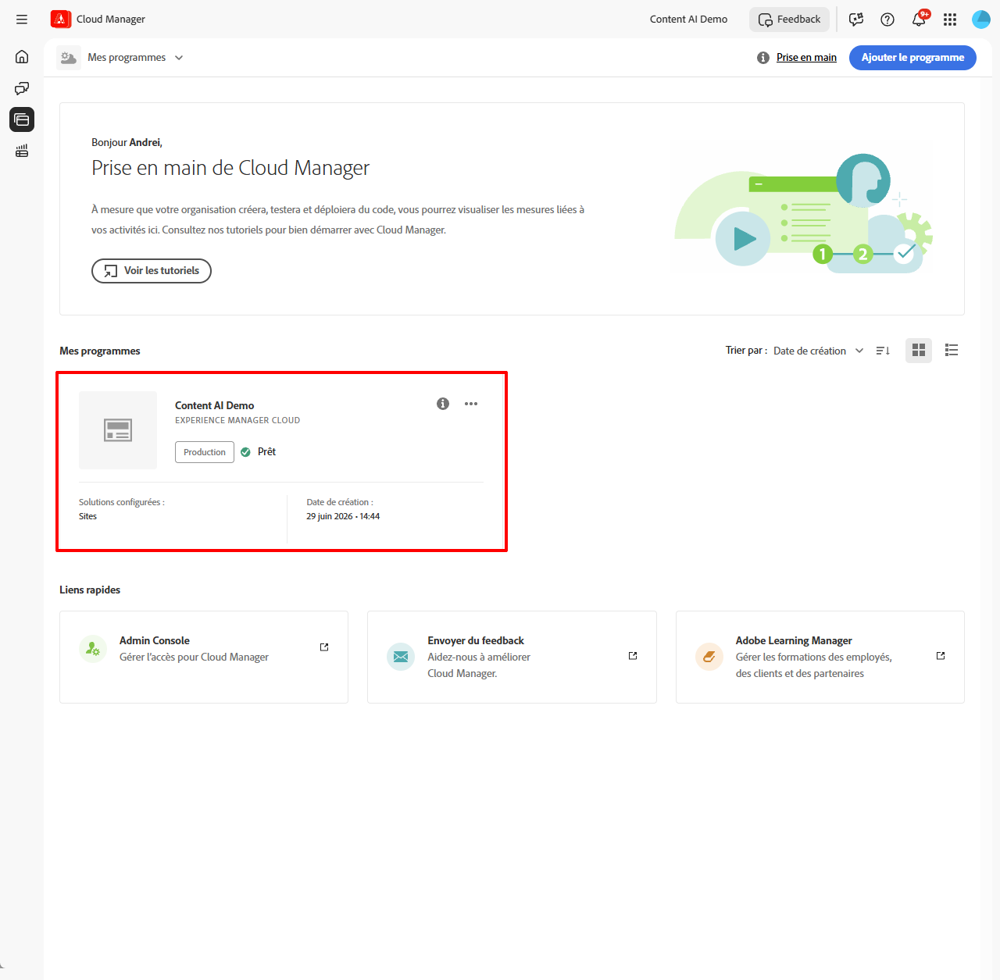

1. Dans la **[!UICONTROL Présentation du programme]**, accédez à la section **[!UICONTROL Environnements]** et sélectionnez l’environnement à configurer.

   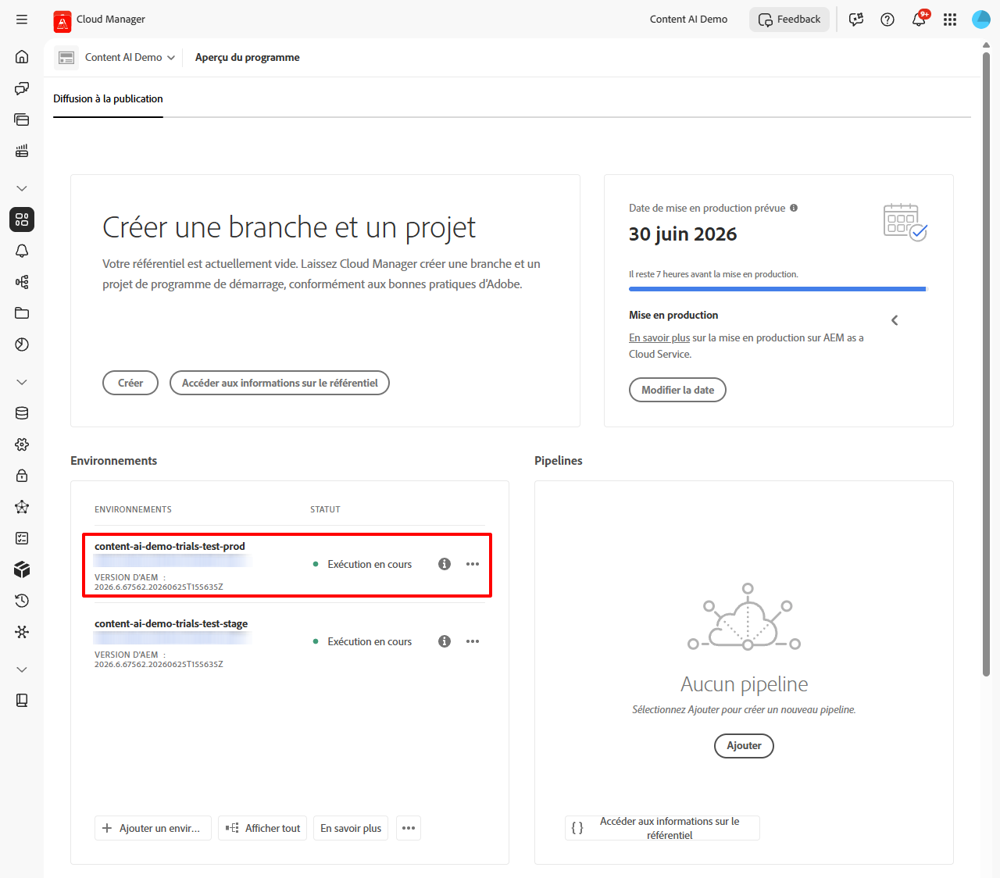

1. Sur la page des détails de l’environnement, sélectionnez l’onglet **[!UICONTROL Configuration de l’IA dédiée au contenu]**.

   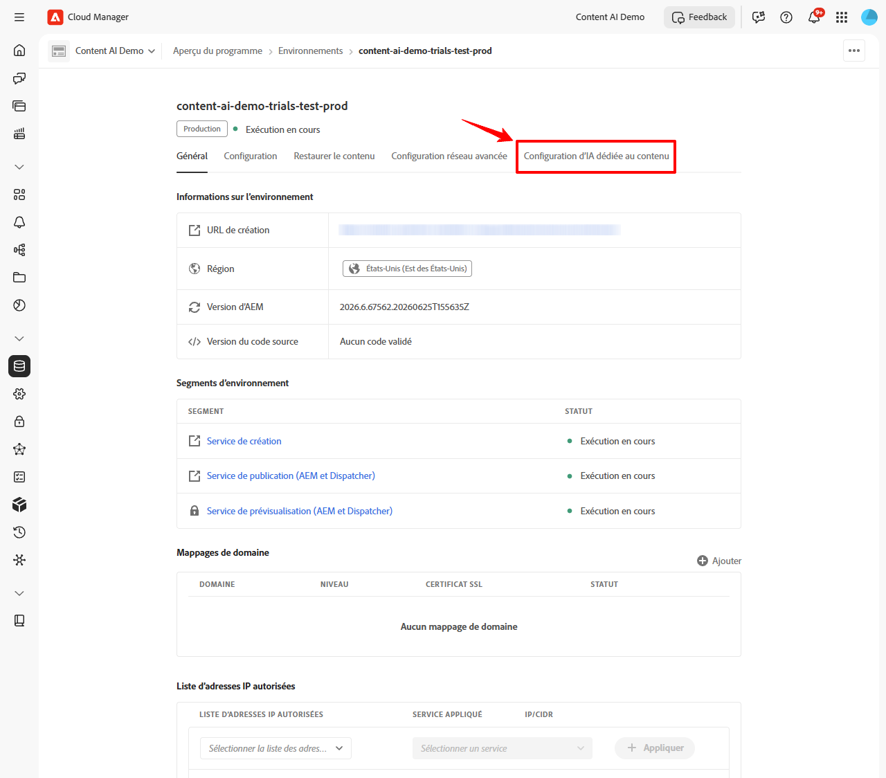

## Étape 2 - Création d’un Source IA dédiée au contenu {#create-source}

Une source de contenu définit le site web que l’IA dédiée au contenu explore et indexe.

1. Dans l’onglet **[!UICONTROL Configuration de l’IA dédiée au contenu]**, sélectionnez **[!UICONTROL Créer un Source]**.

   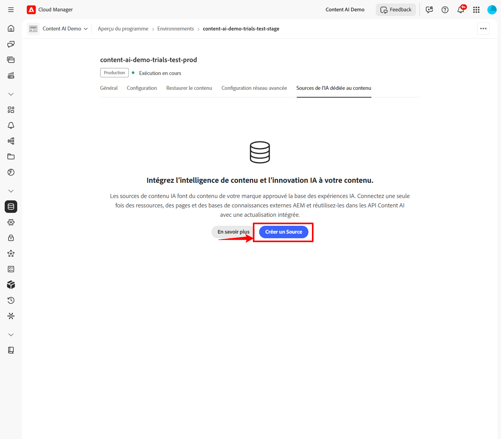

1. Dans la boîte de dialogue **[!UICONTROL Créer/ajouter un nouveau Source IA dédiée au contenu]**, renseignez les champs suivants :

   | Champ | Description |
   | --- | --- |
   | **[!UICONTROL Nom de la configuration de l’IA dédiée au contenu]** | Identifiant unique de cette source (par exemple, `my-site-index`). Impossible de modifier après la création. |
   | **[!UICONTROL Description]** | *(Facultatif)* Brève description de la source de contenu. |
   | **[!UICONTROL Adresse du site web]** | URL racine du site web auquel explorer (par exemple, `https://www.example.com/`). |
   | **[!UICONTROL Exclure les URL]** | *(Facultatif)* les modèles d’URL à ignorer lors de l’explorée. |
   | **[!UICONTROL Fréquence d’actualisation]** | Fréquence à laquelle l’IA dédiée au contenu explore à nouveau la source : hebdomadaire, quotidienne, quotidienne 4×, 60 minutes ou 15 minutes. |

   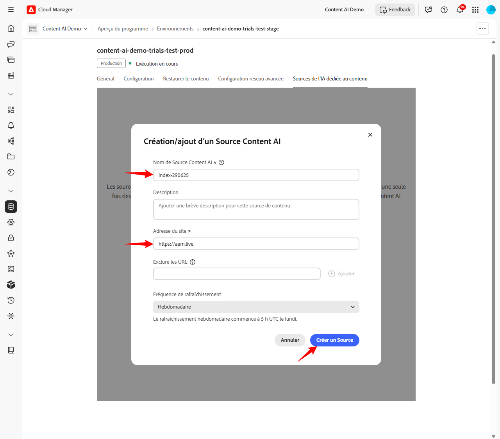

   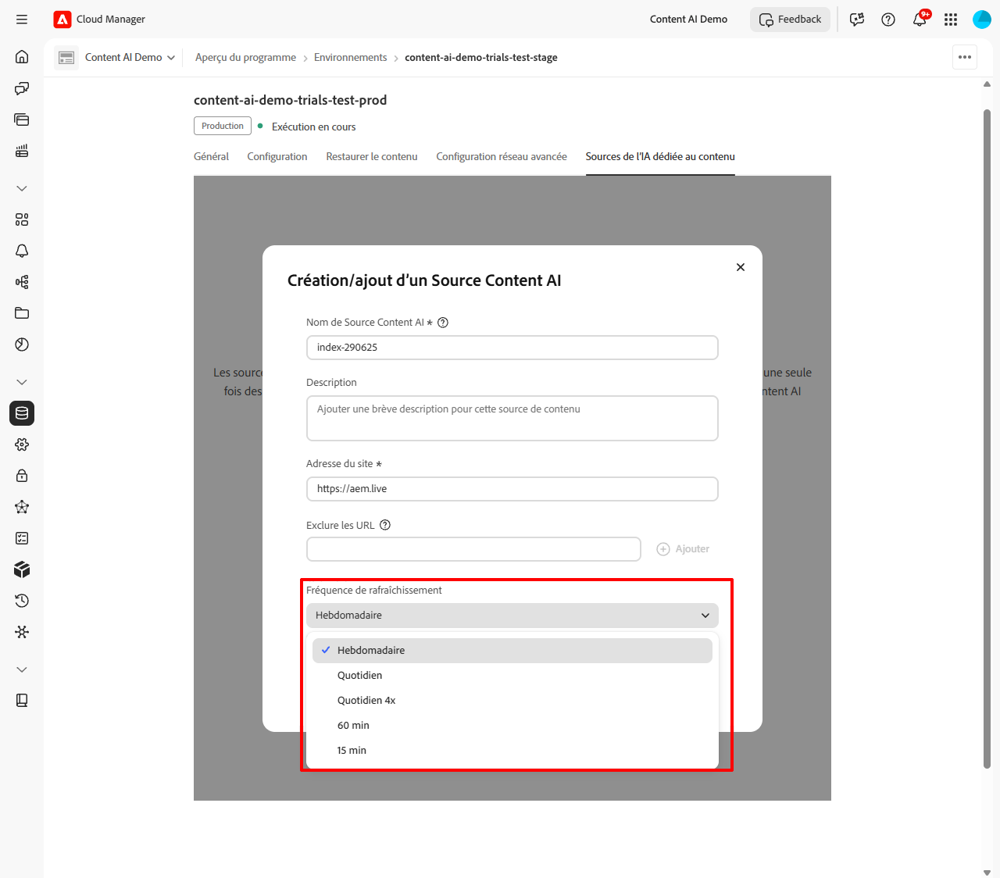

1. Sélectionnez **[!UICONTROL Créer un Source]**. L’acquisition démarre automatiquement et la source passe à **Indexation**.

   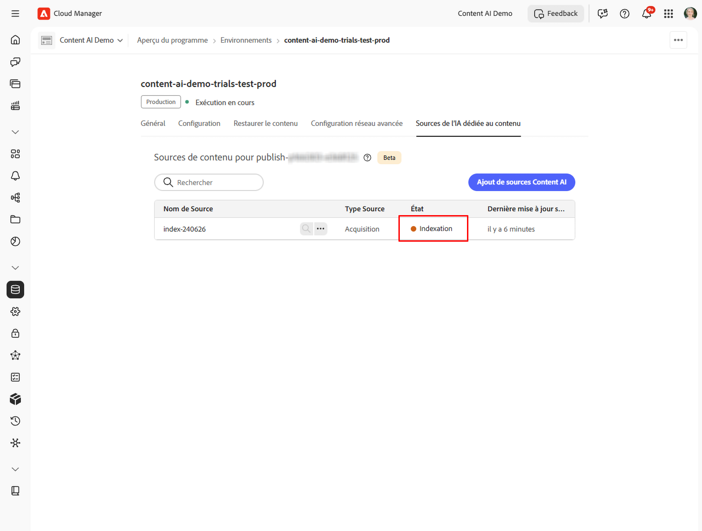

## Etape 3 - Réexécuter l&#39;acquisition {#trigger-acquisition}

L’acquisition s’exécute automatiquement lorsque vous créez une source, puis selon le planning défini par la **[!UICONTROL fréquence d’actualisation]**. Vous pouvez également déclencher une exécution manuelle à tout moment, par exemple, pour réindexer immédiatement après la publication d’un nouveau contenu.

1. Dans la liste des sources, cliquez sur l’icône **plus d’actions** (...) en regard de votre source, puis sélectionnez **[!UICONTROL Déclencher l’acquisition]**.

   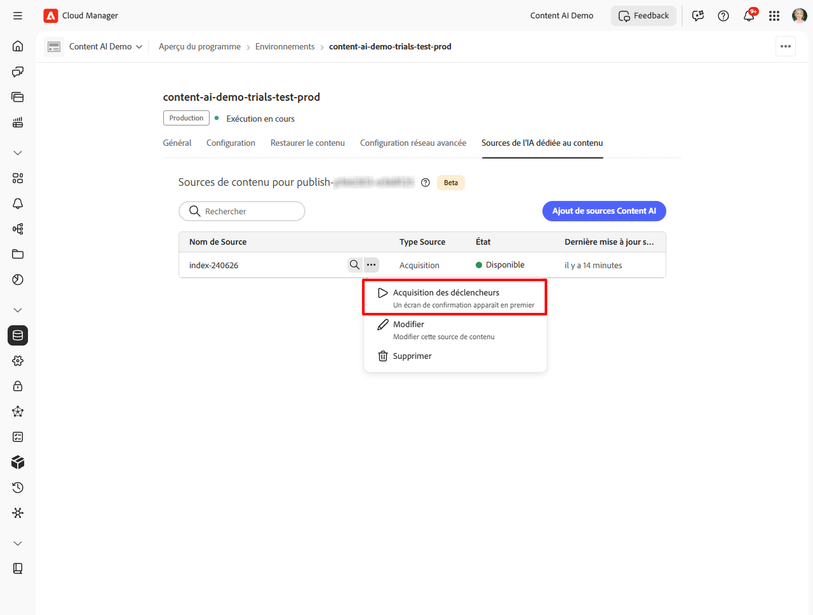

1. Dans la boîte de dialogue **[!UICONTROL Acquisition du déclencheur]**, passez en revue les détails de la source (**[!UICONTROL Source de contenu]**, **[!UICONTROL Dernière exécution]** et **[!UICONTROL Prochaine exécution planifiée]**) et sélectionnez **[!UICONTROL Déclencheur]**.

   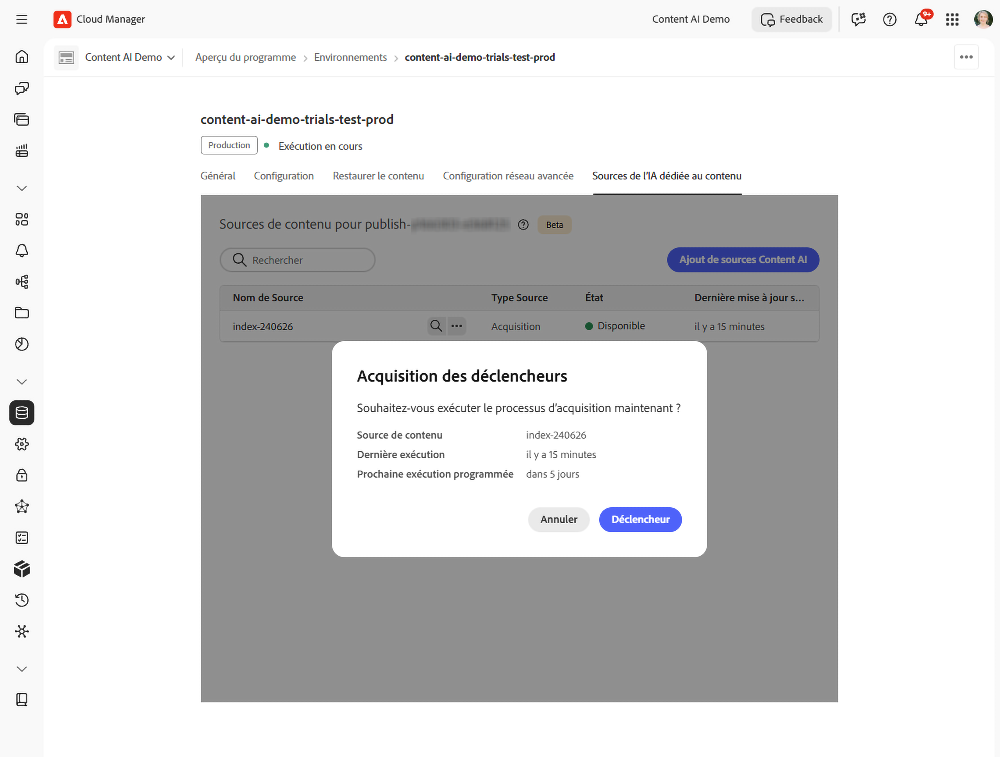

## Étape 4 - Surveiller le statut de l’indexation {#monitor-status}

Une fois l’acquisition commencée, le statut de la source se met à jour en temps réel.

| État | Signification |
| --- | --- |
| **Nouveau** | Source vient de se créer ; l&#39;acquisition automatique n&#39;a pas encore commencé. Ce statut est bref. |
| **Indexation** | L’acquisition est en cours. Le contenu est en cours d’explore et d’indexation. |
| **Disponible** | L’indexation est terminée. La source est prête à répondre aux requêtes de recherche. |

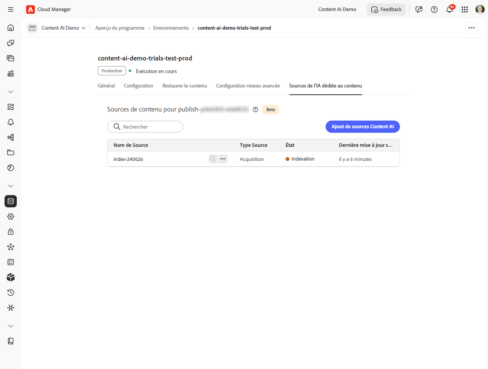

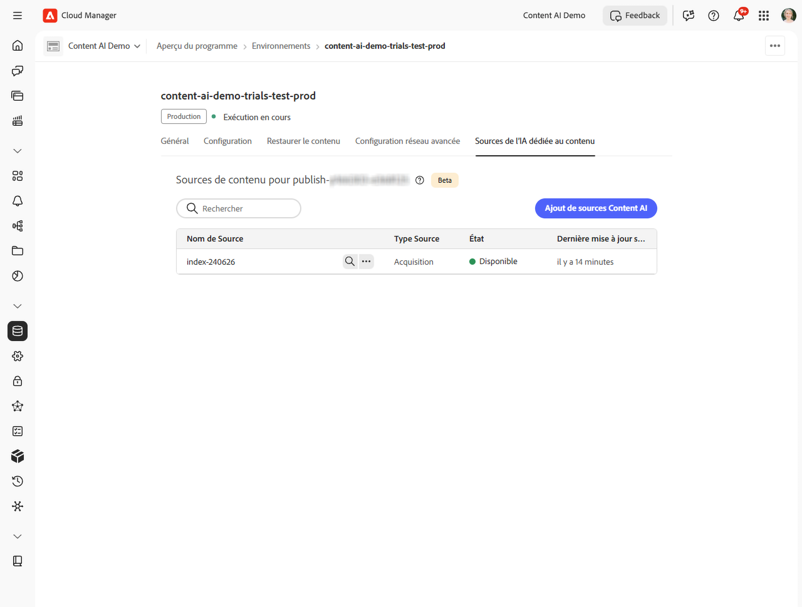

Attendez que le statut atteigne **Disponible** avant de rechercher l’index ou de tester l’API.

## Étape 5 - Recherche de contenu indexé {#search-content}

Une fois le statut de la source **Disponible**, vous pouvez exécuter des requêtes de recherche directement depuis Cloud Manager pour vérifier que le contenu a été indexé correctement.

1. Dans la liste des sources, cliquez sur l’icône **rechercher** (loupe) située en regard de votre source.

   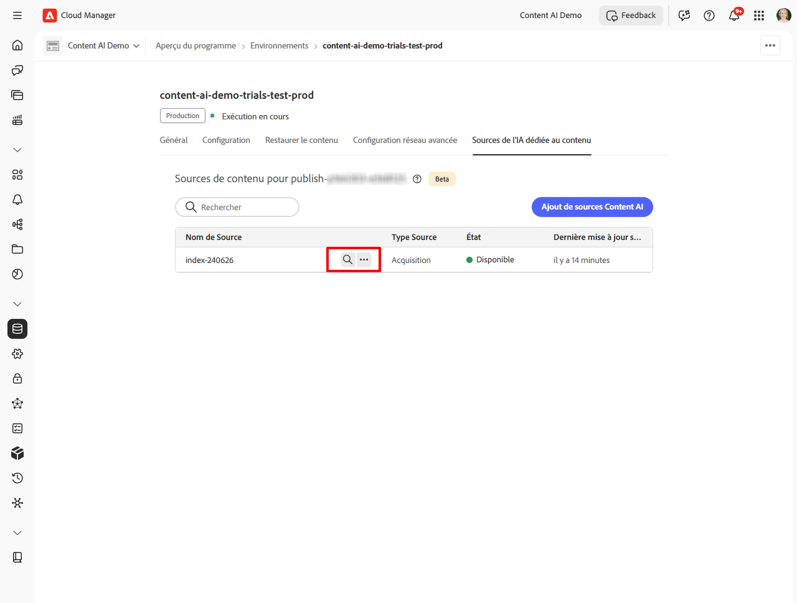

1. Saisissez une requête dans le champ de recherche. Les résultats affichent une liste d’éléments correspondants avec un score et un type de contenu correspondants (par exemple, **PAGE** ou **PDF**). La sélection d’un résultat ouvre un aperçu à droite.

   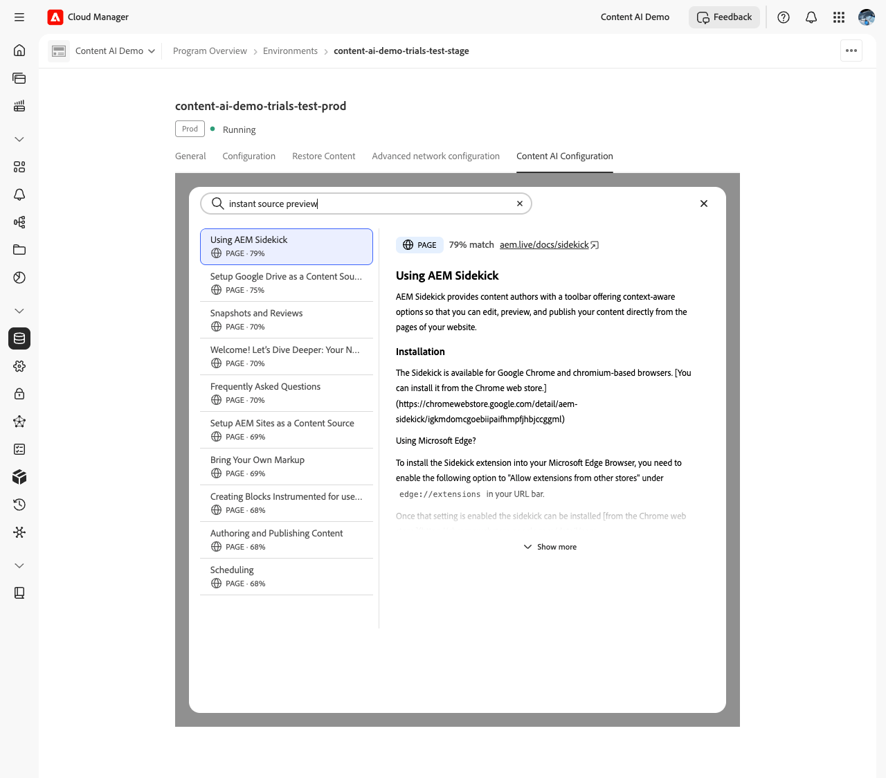

## Modification ou suppression d’un Source {#modify-source}

### Modification d’une source {#modify}

Pour mettre à jour une configuration source après sa création :

1. Dans la liste source, cliquez sur l’icône **autres actions** (...) en regard de la source, puis sélectionnez **[!UICONTROL Modifier]**.

   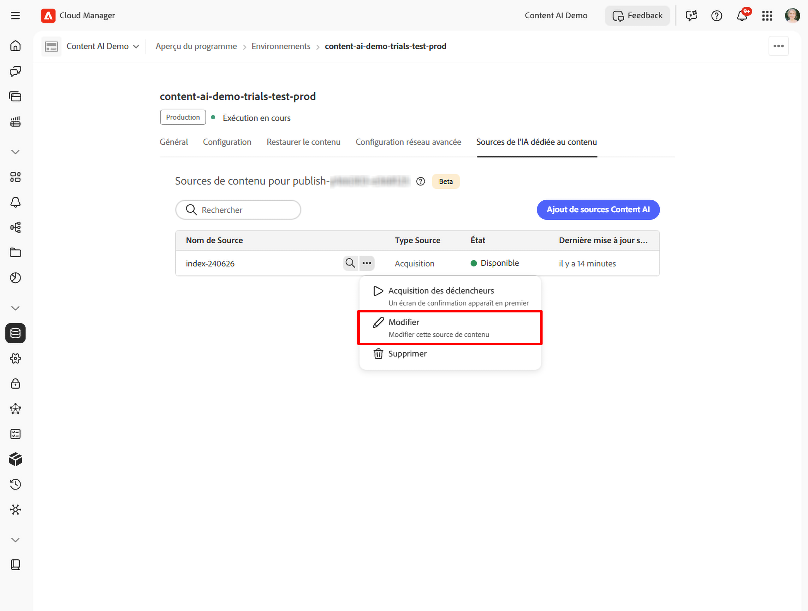

1. Dans la boîte de dialogue **[!UICONTROL Modifier le Source de l’IA dédiée au contenu]**, mettez à jour les **[!UICONTROL Description]**, **[!UICONTROL Adresse du site web]**, **[!UICONTROL Exclure les URL]** ou **[!UICONTROL Fréquence d’actualisation]** selon les besoins. Le **[!UICONTROL Nom de la configuration de l’IA dédiée au contenu]** est en lecture seule et ne peut pas être modifié.

   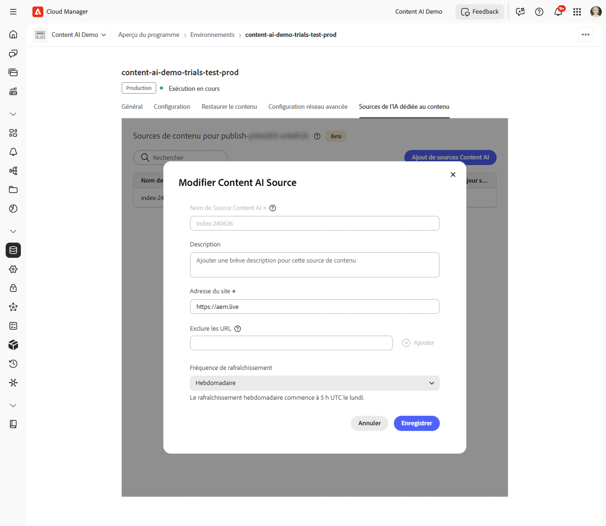

1. Sélectionnez **[!UICONTROL Enregistrer]** pour appliquer les modifications. La liste source est mise à jour pour prendre en compte vos modifications.

### Supprimer une source {#delete}

1. Dans la liste source, cliquez sur l’icône **autres actions** (...) en regard de la source, puis sélectionnez **[!UICONTROL Supprimer]**.

   >[!WARNING]
   >
   >La suppression d’une source est permanente. Tout le contenu indexé pour cette source est supprimé et ne peut plus servir de requêtes de recherche.

Après la suppression, la source n’apparaît plus dans la liste.

## Étapes suivantes {#next-steps}

* [Configuration d’un projet Adobe Developer Console](setup-adc-project.md) - Créez le projet ADC et les informations d’identification dont vous avez besoin pour appeler l’API .
* [Référence de l’API Content AI](https://developer.adobe.com/experience-cloud/experience-manager-apis/api/experimental/contentai/) - Interrogez votre contenu indexé à l’aide de points d’entrée de recherche sémantiques, de texte intégral ou hybrides.

## Résolution des problèmes {#troubleshooting}

* **Source reste dans [!UICONTROL Indexation] pendant une période prolongée.** Réessayez l’acquisition à partir du menu (...). Si le statut ne progresse pas après une seconde exécution, vérifiez que l’**[!UICONTROL adresse du site web]** est accessible au public et que les modèles **[!UICONTROL Exclure les URL]** ne filtrent pas chaque page.
* **Source revient à [!UICONTROL Nouveau] après une exécution.** Le robot d&#39;exploration n’a pu récupérer aucune page de l’URL racine configurée. Vérifiez que l’URL répond avec `200 OK` et que le site ne bloque pas les requêtes automatisées.
* **[!UICONTROL Search] ne renvoie aucun résultat pour une source [!UICONTROL Available].** Indexation réussie, mais aucun contenu ne correspondait à la requête. Effectuez une requête plus large ou vérifiez que les URL explorées incluent les pages attendues.
