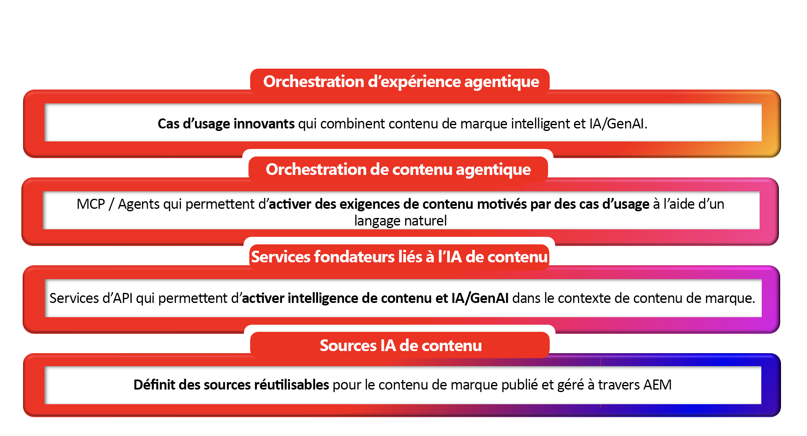

# AEM Content AI - Introduction

## Contenu intelligent, prêt pour l’IA dès la conception {#ai-ready}

Les clients commencent à rencontrer les marques par le biais de l’IA avant même de rencontrer un site web. Assistants de conversation, présentations de l’IA, agents, recherche conversationnelle, assistants d’IA : ils récupèrent, résument et représentent tous le contenu de la marque au nom de la marque. Ce qu’ils disent n’est exact, à jour et intégré à la marque que par rapport au contenu auquel ils peuvent accéder.
C’est pour cela que l’IA dédiée au contenu d’AEM a été conçue. Il traite le contenu de marque comme la vérité de base sur laquelle s’exécutent les expériences d’IA et fournit aux clients AEM les outils nécessaires pour créer cette vérité de base plus rapidement du côté auteur et la diffuser proprement aux expériences axées sur l’IA destinées aux consommateurs du côté publication.

**Côté auteur** l’IA dédiée au contenu AEM fonde la création dans des sources de marque approuvées. La création assistée par l’IA, la découverte de langage naturel dans le contenu de pages, les fragments et les ressources existants, ainsi que la génération basée sur la marque permettent aux équipes de produire des variations pour de nouvelles audiences, régions et canaux sans quitter AEM et sans s’écarter de ce qui est déjà approuvé.

**Côté publication** le même contenu est structuré, régi et adressable pour que l’IA puisse le consommer. Les fragments, les métadonnées, les taxonomies et les sources approuvées sont exposés sous des formes que les systèmes de récupération, les agents et les interfaces conversationnelles peuvent utiliser en toute confiance. Ainsi, lorsque l’IA parle au nom de la marque, elle dit la vérité de la marque.

### Signification pour les clients AEM {#what-it-means}

Le contenu approuvé est la défense de la marque contre les hallucinations. Lorsque l’IA repose sur du contenu AEM régi, les réponses restent par défaut exactes, à jour et sur la marque.
La création suit le rythme de la demande de l’ère de l’IA. Les équipes génèrent des copies et des images pour un plus grand nombre d’audiences et de moments dans l’expérience de création, en puisant à des sources approuvées plutôt qu’en commençant vide.
La découverte fonctionne comme les gens et les machines le demandent. La recherche en langage naturel basée sur l’intention dans les ressources, fragments, pages et formulaires transforme le contenu existant en un fichier réutilisable.
Personalization évolue en fonction de la réutilisation, et non de la duplication. Les composants régis se recombinent en variantes au lieu de se multiplier en copies non suivies.
Les canaux de publication incluent désormais des surfaces d’IA. Le contenu est diffusé sous des formes que les humains, les agents et les expériences médiées par l’IA peuvent tous utiliser, sans pipeline distinct pour chacun.

**Plus important encore : le contenu existant de marque de confiance a plus de valeur aujourd’hui qu’il n’en a jamais eu. Chaque fragment, ressource et page approuvé qui réside déjà dans AEM devient la vérité de base dont dépendent les expériences pilotées par l’IA. L’IA dédiée au contenu AEM est ce qui rend cette bibliothèque réutilisable, découvrable et prête à alimenter ce qui vient ensuite.**

## Aperçu de l’IA dédiée au contenu AEM {#at-a-glance}

L’IA dédiée au contenu d’AEM est structurée sous la forme d’une pile à quatre couches, chaque couche reposant sur l’une des couches ci-dessous, du contenu approuvé à la base aux expériences agentiques qu’elle alimente au sommet.

*Lisez la pile de bas en haut, du contenu approuvé à la base aux expériences agentiques qu’elle alimente au sommet.*

1. Sources IA dédiées au contenu
Les sources de contenu sont des entités gérées dans l’IA dédiée au contenu d’AEM qui se connectent à un corps de contenu approuvé. Un Source de contenu peut référencer un type de contenu régi par AEM tel que des ressources, des fragments de contenu, des pages, des formulaires, des métadonnées et des taxonomies, ainsi que des sources non AEM telles que des sites web tiers, des bases de connaissances ou des portails de documentation. Chaque Source de contenu est automatiquement vectorisé et enrichi sémantiquement pour alimenter les expériences de récupération, de mise à la terre et d’IA conversationnelle. Définissez les sources de contenu une fois et réutilisez-les dans les API d’IA dédiée au contenu avec l’actualisation et les mises à jour automatiques intégrées.

1. Services de base de Content AI
Les API et services qui permettent l’intelligence sémantique et l’IA générative dans le contexte du contenu de la marque. En s’appuyant sur les sources d’IA dédiée au contenu, ces services optimisent la récupération, la génération, la variation et l’optimisation basées sur la marque, le tout basé sur le contenu approuvé du client.

1. Agentic Content Orchestration
les MCP et les agents qui transforment les exigences de contenu basées sur des cas d’utilisation en une action coordonnée en langage naturel ; Cette couche permet aux auteurs et aux autres agents de décrire leurs besoins en langage simple et d’obtenir les services fondamentaux appropriés orchestrés pour y répondre.

1. Agentic Experience Orchestration
Les cas pratiques innovants qui émergent lorsque le contenu intelligent de la marque rencontre l’IA à grande échelle. Les solutions AEM elles-mêmes sont créées sur ces services de base. Les clients peuvent utiliser directement les mêmes API pour créer leurs propres expériences agentiques sur leur propre contenu. Des chaînes d’approvisionnement de contenu optimisées par l’IA aux parcours utilisateur conversationnels, c’est sur cette couche que le contenu régi devient un avantage concurrentiel.

Ces couches sont connectées par conception : chaque service d’IA puise dans la base de contenu et tout ce qui est produit retourne dans le même système gouverné - de sorte que la création côté auteur et la diffusion côté publication partagent une source de vérité.

## AEM Content AI en action {#action}

Pour obtenir une intégration IA dédiée au contenu qui fonctionne, deux tâches sont nécessaires :

### &#x200B;1. Activation de l’IA dédiée au contenu pour votre environnement AEM {#enable}

**Condition requise** avant de commencer à utiliser l’IA dédiée au contenu, vous devez connaître les informations d’identification d’API de votre environnement AEM as a Cloud Service. Voir [Configuration d’un projet Adobe Developer Console](setup-adc-project.md).

### &#x200B;2. Contrôle des sources d’IA dédiée au contenu {#control}

Configurez et gérez vos sources d’IA de contenu pour activer les expériences basées sur l’IA. Voir [Contrôler vos sources de contenu](contentsources.md).

## Découvrir les API de l’IA dédiée au contenu  {#apis}

Explorez l’ampleur fonctionnelle de l’IA dédiée au contenu d’AEM : les API présentent le plein potentiel de la plateforme. Voir [API IA dédiée au contenu](https://developer.adobe.com/experience-cloud/experience-manager-apis/api/experimental/contentai/).
