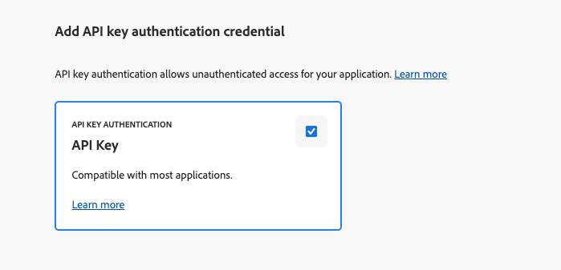

# Configurer un projet Adobe Developer Console {#configure-adc-project}

Pour appeler l’API de services d’IA dédiée au contenu d’AEM, vous avez besoin d’informations d’identification émises par un projet Adobe Developer Console (ADC). Cette page vous guide tout au long de la création du projet, de la sélection d’une méthode d’authentification et de la génération des informations d’identification que vous incluez dans chaque requête API.

Accédez à [Adobe Developer Console](https://developer.adobe.com/console/) pour votre organisation afin de commencer.

## Prérequis {#prerequisites}

Avant de commencer, vérifiez que vous disposez des éléments suivants :

* Vous avez accès à [Adobe Developer Console](https://developer.adobe.com/console/) pour votre organisation.
* Vous avez le rôle de **développeur ou développeuse** sur le profil de produit de services d’IA dédiée au contenu d’AEM dans **Adobe Admin Console**. Sans ce rôle, la carte de l’API **[!UICONTROL Services d’IA dédiée au contenu d’AEM]** apparaît désactivée et l’option d’authentification **[!UICONTROL serveur à serveur]** est masquée.
* Vous connaissez les numéros de programme et d’environnement du profil de produit que vous souhaitez sélectionner (par exemple, `AEM User - publish - Program 12345 - Environment 67890`).
* Vous détenez le rôle **[Administrateur ou administratrice système](https://experienceleague.adobe.com/fr/docs/support-resources/adobe-support-tools-guide/adobe-admin-console/admin-roles)** dans Admin Console pour le programme. Ce rôle vous permet de gérer les profils de produit et d’affecter des utilisateurs et utilisatrices à l’environnement.

## Choisir une méthode d’authentification {#choose-auth}

Les services d’IA dédiée au contenu d’AEM prennent en charge deux méthodes d’authentification. Sélectionnez celle qui correspond à votre intégration :

| Méthode | Idéal pour |
| --- | --- |
| [Serveur à serveur](#s2s-auth) | Services backend qui appellent l’API sans intervention de l’utilisateur ou utilisatrices. Renvoie un jeton d’accès de courte durée. |
| [Clé API](#api-key-auth) | Intégrations côté client ou basées sur un navigateur qui appellent directement l’API. Renvoie une clé à longue durée de vie limitée aux domaines autorisés. |

## Authentification de serveur à serveur {#s2s-auth}

1. Sélectionnez **[!UICONTROL API et services]**, puis **[!UICONTROL API]**.

   

1. Filtrez par **Services d’IA dédiée au contenu d’AEM**, puis sélectionnez **[!UICONTROL Créer un projet]** pour démarrer un nouveau projet, ou **[!UICONTROL Ajouter une API]** si vous ajoutez le service à un projet existant.

   >[!NOTE]
   >
   >Si la carte de l’API est désactivée avec un message « Licence requise », il se peut que votre environnement AEM as a Cloud Service n’ait pas été modernisé. Consultez [Moderniser lʼenvironnement AEM as a Cloud Service](https://experienceleague.adobe.com/fr/docs/experience-manager-learn/cloud-service/aem-apis/openapis/setup#modernization-of-aem-as-a-cloud-service-environment).

1. Dans la boîte de dialogue **[!UICONTROL Configurer l’API]** , sélectionnez l’authentification **[!UICONTROL Serveur à serveur]**.

   

   >[!TIP]
   >
   >Si l’option d’authentification de serveur à serveur n’est pas disponible, la personne qui configure l’intégration n’est pas ajoutée en tant que développeur ou développeuse au profil de produit auquel le service est associé. Consultez [Activer l’authentification de serveur à serveur](https://developer.adobe.com/developer-console/docs/guides/authentication/ServerToServerAuthentication/implementation).

1. Si nécessaire, renommez les informations d’identification. Sélectionnez **[!UICONTROL Suivant]**.

   

1. Sélectionnez le profil de produit **[!UICONTROL Utilisateur et utilisatrice AEM – publication – Programme XXX – Environnement XXX]** et/ou **[!UICONTROL Utilisateur et utilisatrice AEM – création – Programme XXX – Environnement XXX]** et cliquez sur **[!UICONTROL Enregistrer]**.

   

1. Vérifier l’API et la configuration de l’authentification

   

   

### Générer un jeton d’accès {#generate-token}

1. Dans votre projet ADC, accédez à **[!UICONTROL Informations d’identification]** et sélectionnez **[!UICONTROL Générer un jeton d’accès]**.

   

1. Incluez le jeton dans l’en-tête `Authorization` de chaque requête API :

   ```http
   Authorization: Bearer YOUR_ACCESS_TOKEN
   ```

   >[!WARNING]
   >
   >Conservez le jeton en toute sécurité. Il expire et doit être régénéré régulièrement.

## Authentification par clé API {#api-key-auth}

1. Lors de l’ajout de l’API Services d’IA dédiée au contenu d’AEM à votre projet, sélectionnez **[!UICONTROL Clé API]** dans la boîte de dialogue **[!UICONTROL Sélectionner le type d’authentification]**.

   

1. Confirmez les informations d’identification de la clé API.

   

1. Pour limiter les sources qui peuvent utiliser la clé, configurez les domaines autorisés.

   

1. Votre clé API (ID client) s’affiche sous **[!UICONTROL Informations d’identification connectées]**. Sélectionnez **[!UICONTROL Copier]**.

   

1. Incluez la clé dans chaque requête API :

   ```http
   x-api-key: YOUR_API_KEY
   ```

   Votre projet est désormais prêt. Utilisez la clé avec chaque requête à Services d’IA dédiée au contenu d’AEM.

## Étapes suivantes {#next-steps}

* [Contrôler vos sources de contenu](contentsources.md) : configurez une source de contenu dans Cloud Manager et déclenchez l’acquisition.
* [Référence de l’API d’IA dédiée au contenu](https://developer.adobe.com/experience-cloud/experience-manager-apis/api/experimental/contentai/) : utilisez votre jeton d’accès ou votre clé API pour interroger le contenu indexé.
